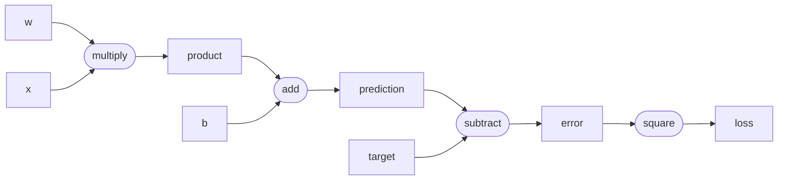

# 2.7 计算图与自动求导(computational graph and automatic differentiation)

> 重要度：⭐⭐（理解深度学习框架怎样自动得到梯度）
> 目标：能解释框架怎样记录计算、为什么要逆序反传、分叉处为什么累加梯度，并分清 `backward()`、`step()`、`zero_grad()`
> 前置：2.3 梯度 · 2.4 链式法则 · 2.5 梯度下降 · 2.6 学习率
> 配套视频：[Karpathy · micrograd](https://www.youtube.com/watch?v=VMj-3S1tku0)

---

## 一句话总结

**自动求导会在前向计算时，把每一步运算及其输入记录成计算图；反向时从损失出发，按逆拓扑顺序反复执行“上游梯度 × 本地导数”，并在多条路径汇合处相加，最终得到每个参数的梯度。**

可以把前面几节连成一条完整链路：

```text
前向计算并记录计算图
        ↓
损失 backward
        ↓
链式法则自动算出参数梯度
        ↓
optimizer.step 读取梯度并更新参数
        ↓
zero_grad 清理旧梯度
```

其中：

- **计算图**负责记录“结果是怎样一步步算出来的”
- **自动求导**负责沿图自动应用链式法则
- **反向传播**是反向模式自动求导在神经网络中的常用名称
- **优化器**拿到梯度后才真正修改参数

---

## 1. 为什么框架能够自动算梯度？

假设程序写的是：

```python
y_hat = w * x + b
error = y_hat - target
loss = error ** 2
loss.backward()
```

框架并不是等到 `backward()` 时才重新阅读这几行 Python，也不是把整个表达式交给数学公式求导器。

在每一步前向运算发生时，它已经记录了：

| 前向结果 | 由谁算出 | 运算 |
|---|---|---|
| `product` | `w`, `x` | 乘法 |
| `y_hat` | `product`, `b` | 加法 |
| `error` | `y_hat`, `target` | 减法 |
| `loss` | `error` | 平方 |

每种基础运算只需预先实现自己的**本地求导规则**：

| 运算 | 前向 | 反向时需要的本地导数 |
|---|---|---|
| 加法 | $c=a+b$ | $\dfrac{\partial c}{\partial a}=1,\ \dfrac{\partial c}{\partial b}=1$ |
| 乘法 | $c=ab$ | $\dfrac{\partial c}{\partial a}=b,\ \dfrac{\partial c}{\partial b}=a$ |
| 平方 | $c=a^2$ | $\dfrac{\partial c}{\partial a}=2a$ |
| ReLU | $c=\max(0,a)$ | $a>0$ 时为 $1$，$a<0$ 时为 $0$ |

复杂模型虽然包含大量运算，但仍然由加法、乘法、矩阵乘法、归一化、激活函数等有限的基础操作组成。框架把这些本地规则按计算图连接起来，就能利用链式法则得到整个模型的梯度。

> **自动求导不是“不需要求导规则”，而是“每种基础运算只实现一次本地规则，之后由框架自动组合”。**

---

## 2. 什么是计算图？

计算图是一个有向无环图(directed acyclic graph, DAG)：

- **节点(node)**：输入、参数或某一步运算的结果
- **边(edge)**：一个节点依赖哪些上游节点
- **方向**：从输入和参数指向最终输出
- **无环**：一个结果不能在尚未算出时又成为自己的前置输入

对：

$$
L=(wx+b-t)^2
$$

可以拆成：

$$
p=wx,\qquad
\hat y=p+b,\qquad
e=\hat y-t,\qquad
L=e^2
$$

对应计算图：



图中矩形表示数值节点，圆角节点表示运算节点。多条输入边表示**汇合**：`w` 和 `x` 汇入乘法，`product` 和 `b` 汇入加法，`prediction` 和 `target` 汇入减法。只有当同一个节点被多个后续运算使用时，才称为**分叉**。

图中只描述依赖关系。真正的数学公式单独写在图外，这样更容易区分：

- **前向传播**：沿箭头方向计算每个节点的数值
- **反向传播**：从损失开始，逆着箭头传播梯度

### 2.1 叶子节点与中间节点

**叶子节点(leaf node)** 通常是直接由用户创建的节点：

- 模型参数，如 $w,b$
- 输入数据，如 $x$
- 标签，如 $t$

**中间节点(non-leaf node)** 是运算结果：

- $p=wx$
- $\hat y=p+b$
- $e=\hat y-t$
- $L=e^2$

训练时最关心的是模型参数这些叶子节点的 `.grad`。中间节点的梯度主要用于继续向前传播，通常不需要长期保留。

### 2.2 动态图

PyTorch 默认使用动态计算图：**程序每执行一次前向传播，就根据这一次实际执行的运算建立一张图。**

因此下面的分支可以在不同输入下建立不同的图：

```python
if x.data > 0:
    y = x * 2
else:
    y = x * x
```

这也是 PyTorch 代码可以直接使用 Python 控制流的原因。一次 `backward()` 完成后，图通常会被释放；下一次训练 step 会由新的前向传播重新建图。

---

## 3. 完整走一遍：从前向计算到参数梯度

仍使用：

$$
L=(wx+b-t)^2
$$

取：

$$
w=1.5,\qquad x=2,\qquad b=0.5,\qquad t=3
$$

### 3.1 前向传播：算数值并建图

$$
p=wx=1.5\times2=3
$$

$$
\hat y=p+b=3+0.5=3.5
$$

$$
e=\hat y-t=3.5-3=0.5
$$

$$
L=e^2=0.25
$$

框架保存的不只是最终的 $0.25$，还保存了中间结果和依赖关系。乘法反向时需要知道另一侧输入，加法反向时需要知道梯度应传给哪两个父节点。

### 3.2 反向起点：为什么把损失梯度设为 1？

反向传播要从：

$$
\frac{\partial L}{\partial L}
$$

开始。一个量对自己的导数为：

$$
\boxed{\frac{\partial L}{\partial L}=1}
$$

这就是 `loss.backward()` 默认给标量损失放入种子梯度(seed gradient) `1` 的原因。它表示：

> 如果损失自身变化 1，损失当然变化 1。

### 3.3 从后往前：上游梯度乘本地导数

先经过平方节点：

$$
\frac{\partial L}{\partial e}
=
\frac{\partial L}{\partial L}
\frac{\partial L}{\partial e}
=
1\times2e
=1
$$

经过减法节点：

$$
\frac{\partial L}{\partial \hat y}
=
\frac{\partial L}{\partial e}
\frac{\partial e}{\partial \hat y}
=
1\times1
=1
$$

经过加法节点：

$$
\frac{\partial L}{\partial p}
=
\frac{\partial L}{\partial \hat y}
\frac{\partial \hat y}{\partial p}
=1\times1
=1
$$

$$
\frac{\partial L}{\partial b}
=
\frac{\partial L}{\partial \hat y}
\frac{\partial \hat y}{\partial b}
=1\times1
=1
$$

最后经过乘法节点：

$$
\frac{\partial L}{\partial w}
=
\frac{\partial L}{\partial p}
\frac{\partial p}{\partial w}
=
1\times x
=2
$$

$$
\frac{\partial L}{\partial x}
=
\frac{\partial L}{\partial p}
\frac{\partial p}{\partial x}
=
1\times w
=1.5
$$

标签所在路径为：

$$
\frac{\partial L}{\partial t}
=
\frac{\partial L}{\partial e}
\frac{\partial e}{\partial t}
=
1\times(-1)
=-1
$$

最终：

| 节点 | 梯度 |
|---|---:|
| $w$ | $\dfrac{\partial L}{\partial w}=2$ |
| $b$ | $\dfrac{\partial L}{\partial b}=1$ |
| $x$ | $\dfrac{\partial L}{\partial x}=1.5$ |
| $t$ | $\dfrac{\partial L}{\partial t}=-1$ |

训练时只更新模型参数 $w,b$。输入和标签即使在数学上有导数，通常也不会交给优化器更新。

---

## 4. 一个自动求导引擎只需要三套核心机制

### 4.1 前向运算时记录父节点

一个标量节点最少需要保存：

```python
data       # 当前节点的前向数值
grad       # 最终损失对当前节点的梯度
parents    # 当前节点由哪些节点计算而来
operation  # 使用了什么运算
backward   # 怎样把当前梯度传给父节点
```

例如 `out = a * b`：

```python
out.data = a.data * b.data
out.parents = (a, b)
out.operation = "multiply"
```

### 4.2 每种运算实现本地反向规则

若：

$$
c=ab
$$

并且已经从后面收到上游梯度：

$$
g=\frac{\partial L}{\partial c}
$$

乘法节点只需执行：

$$
\frac{\partial L}{\partial a}
\mathrel{+}=
g\frac{\partial c}{\partial a}
=gb
$$

$$
\frac{\partial L}{\partial b}
\mathrel{+}=
g\frac{\partial c}{\partial b}
=ga
$$

代码形式：

```python
a.grad += out.grad * b.data
b.grad += out.grad * a.data
```

这里的 `out.grad` 是**上游梯度**，`b.data` 和 `a.data` 是乘法的**本地导数**。

### 4.3 按逆拓扑顺序执行反向规则

拓扑顺序保证：每个节点都排在它依赖的父节点之后。

前向拓扑顺序可以是：

```text
w, x, product, b, prediction, target, error, loss
```

反向传播要把它倒过来：

```text
loss, error, target, prediction, b, product, x, w
```

为什么不能随便反传？

假设某个节点被后面两条路径共同使用。必须先等两条下游路径都把梯度传回来并完成相加，才能继续把完整梯度传给更前面的节点。

> **逆拓扑顺序保证“先收齐来自所有下游的梯度，再继续向父节点传播”。**

---

## 5. 分叉处为什么必须使用 `+=`？

考虑：

$$
y=x^2+x
$$

这里 $x$ 通过多条路径影响 $y$：

```text
              ┌─→ multiply left input ─┐
x ────────────┼─→ multiply right input ├─→ add ─→ y
              └─→ direct add input ────┘
```

对 $x$ 求导：

$$
\frac{dy}{dx}
=
\underbrace{x}_{\text{乘法左输入路径}}
+
\underbrace{x}_{\text{乘法右输入路径}}
+
\underbrace{1}_{\text{直接相加路径}}
=2x+1
$$

当 $x=3$：

$$
\frac{dy}{dx}=3+3+1=7
$$

如果反向规则写成：

```python
x.grad = contribution
```

后到达的路径会覆盖前一条路径，最终只能留下某一部分梯度。正确做法是：

```python
x.grad += contribution
```

这对应链式法则的核心规律：

> **同一条路径内的导数相乘，多条路径对同一节点的贡献相加。**

参数共享、残差连接、注意力以及一个权重被多个 token 使用时，都会产生大量这种梯度累加。

---

## 6. 自动求导不等于符号求导，也不等于数值求导

| 方法 | 做法 | 优点 | 局限 |
|---|---|---|---|
| 符号求导 | 操作数学表达式，生成新公式 | 可得到解析表达式 | 复杂表达式可能膨胀，难直接对应任意程序控制流 |
| 数值求导 | 对输入加减很小的 $h$，用差商近似 | 实现简单，适合 gradient check | 有截断/舍入误差；每个参数都要重复前向，训练太慢 |
| 自动求导 | 运行原程序，同时记录基础运算并组合本地导数 | 精确到浮点运算误差；高效；适合程序 | 需要保存计算图和部分中间值，占用内存 |

自动求导得到的是当前输入点处的数值梯度，不一定生成一条人类可读的整体导数公式。

---

## 7. 为什么神经网络使用反向模式自动求导？

训练通常是：

- 输入：数百万到数千亿个参数
- 输出：一个标量损失 $L$

我们需要一次得到：

$$
\frac{\partial L}{\partial\theta_1},
\frac{\partial L}{\partial\theta_2},
\ldots,
\frac{\partial L}{\partial\theta_n}
$$

### 7.1 正向模式

正向模式从某个输入方向出发，把“该输入怎样影响后面节点”一路向前传播。若有 $n$ 个参数，通常需要对许多输入方向分别传播。

### 7.2 反向模式

反向模式从一个标量损失出发，一次向后传播，就能得到损失对所有可训练参数的梯度。

因此：

> **参数很多、标量输出很少时，反向模式特别合适；神经网络训练正是这种结构。**

反向传播不是另一套不同于自动求导的数学：

$$
\boxed{\text{反向传播}=\text{反向模式自动求导在神经网络上的应用}}
$$

---

## 8. 从标量节点扩展到张量节点

真实框架的节点通常不是一个数，而是张量。原理仍然相同，只是本地反向规则变成张量运算。

例如：

$$
Y=XW
$$

假设从后面收到：

$$
G=\frac{\partial L}{\partial Y}
$$

矩阵乘法的本地反向规则为：

$$
\frac{\partial L}{\partial X}=GW^\mathsf T
$$

$$
\frac{\partial L}{\partial W}=X^\mathsf TG
$$

形状检查：

| 张量 | 形状 |
|---|---|
| $X$ | $(B,D_\text{in})$ |
| $W$ | $(D_\text{in},D_\text{out})$ |
| $Y=XW$ | $(B,D_\text{out})$ |
| $G=\partial L/\partial Y$ | $(B,D_\text{out})$ |
| $GW^\mathsf T$ | $(B,D_\text{in})$，与 $X$ 相同 |
| $X^\mathsf TG$ | $(D_\text{in},D_\text{out})$，与 $W$ 相同 |

### 8.1 广播的反向传播

若偏置：

$$
Y=X+b
$$

$b$ 可能从形状 $(D,)$ 广播到 $(B,D)$。反向时，每个 batch 样本都对同一个 $b$ 有贡献，因此必须沿被广播的 batch 维求和：

$$
\frac{\partial L}{\partial b}
=
\sum_{i=1}^{B}
\frac{\partial L}{\partial Y_i}
$$

这就是“前向广播，反向按广播维度求和”。

### 8.2 框架通常计算向量－雅可比积

框架通常不会显式创建巨大雅可比矩阵。每个节点接收上游梯度，再直接计算它与本地雅可比的乘积，也就是 vector-Jacobian product(VJP)。

这避免了为每层创建巨大矩阵，是反向传播能够在大模型中实际运行的重要原因。

---

## 9. 一次训练 step 中各组件的职责

典型 PyTorch 风格训练循环：

```python
optimizer.zero_grad()

logits = model(tokens)
loss = cross_entropy(logits, targets)

loss.backward()
optimizer.step()
```

逐行解释：

| 操作 | 是否建图 | 是否计算梯度 | 是否修改参数 |
|---|:---:|:---:|:---:|
| `model(tokens)` | ✅ | ❌ | ❌ |
| `cross_entropy(...)` | ✅ | ❌ | ❌ |
| `loss.backward()` | 不建立训练主图 | ✅ | ❌ |
| `optimizer.step()` | 通常 ❌ | ❌ | ✅ |
| `optimizer.zero_grad()` | ❌ | ❌ | ❌，只清梯度 |

必须记牢：

```text
forward       建图并计算预测与损失
backward      根据图计算梯度
step          根据梯度更新参数
zero_grad     清除旧梯度
```

### 9.1 为什么 `backward()` 不直接更新参数？

把计算梯度和更新参数分开有很多好处：

- 可以在多个 mini-batch 上累积梯度后再更新
- 可以先做梯度裁剪
- 可以选择 SGD、AdamW 等不同优化器
- 可以检查、记录或修改梯度
- 同一套自动求导机制可以配合不同更新策略

---

## 10. 梯度为什么默认累积？

在 PyTorch 中，叶子参数的 `.grad` 默认使用累加而不是覆盖。

假设第一次反向得到：

$$
\frac{\partial L_1}{\partial w}=3
$$

没有清零，又对第二个新计算图反向得到：

$$
\frac{\partial L_2}{\partial w}=4
$$

最终：

$$
w.\text{grad}=3+4=7
$$

这正好支持梯度累积：

$$
\frac{\partial(L_1+L_2)}{\partial w}
=
\frac{\partial L_1}{\partial w}
+
\frac{\partial L_2}{\partial w}
$$

但如果你本来不想累积，忘记 `zero_grad()` 就会把旧梯度错误带进下一次更新。

常见训练顺序：

```python
optimizer.zero_grad()
loss.backward()
optimizer.step()
```

也有人把清零放在 `step()` 之后。关键不是固定位置，而是：**每次不需要跨 step 累积时，必须在下一次反传前清掉旧梯度。**

---

## 11. `requires_grad`、`no_grad` 与 `detach`

### 11.1 `requires_grad`

参数通常设置：

```python
w = torch.tensor(1.5, requires_grad=True)
```

表示需要追踪与 $w$ 有关的运算，并在反向传播后得到 `w.grad`。

输入 token ID、标签等通常不需要梯度。模型激活虽然不是参数，但为了把梯度继续传到更前面的参数，往往仍是计算图的一部分。

### 11.2 `no_grad`

推理或参数更新时不需要建立训练计算图：

```python
with torch.no_grad():
    prediction = model(tokens)
```

用途：

- 推理时减少显存和计算开销
- 手动更新参数时避免把更新动作本身记录进下一张图

### 11.3 `detach`

`detach()` 返回共享当前数据但切断梯度历史的张量。后续计算不会再把梯度传回被切断的上游图。

直觉：

```text
原计算图 ─→ tensor ─X─→ detached tensor ─→ 后续计算
                   梯度到这里停止
```

应当有明确理由再切断；误用 `detach()` 会让本应训练的部分收不到梯度。

### 11.4 原地操作要谨慎

反向规则可能需要前向时保存的旧值。如果在反向前通过原地操作修改了它，框架可能无法正确计算梯度，因此会报错或限制某些操作。

---

## 12. 自动求导怎样服务 LLM 训练？

一次简化的 LLM 训练前向图：

```text
token IDs
   ↓
embedding
   ↓
many Transformer blocks
   ↓
logits
   ↓
cross entropy
   ↓
scalar loss
```

每个 Transformer block 内又包含：

- LayerNorm
- Q、K、V 线性投影
- 矩阵乘法和 softmax
- 注意力加权
- MLP
- 残差连接

这些都是框架已知反向规则的基础张量运算。调用一次：

```python
loss.backward()
```

梯度就会从交叉熵开始，依次穿过输出层、最后一个 Transformer block，一直传到最早的 embedding 和所有参数。

### 12.1 参数共享意味着梯度求和

同一组模型参数会被：

- batch 中多个样本使用
- 序列中多个 token 位置使用
- 某些结构中的多条路径使用

因此某个参数的最终梯度是所有相关使用位置贡献的总和或平均值。计算图中的 `+=` 正是在完成这些汇总。

### 12.2 自动求导为什么占显存？

反向计算本地导数时，经常需要前向阶段的中间激活。例如：

- 乘法需要保存另一侧输入
- ReLU 需要知道哪些位置大于 0
- softmax、LayerNorm 的反向需要前向结果或统计量

因此训练不仅要存参数，还要存供反向使用的激活。

### 12.3 梯度检查点

gradient checkpointing 的核心取舍是：

- 前向时不保存所有中间激活
- 反向需要时重新计算部分前向结果
- 用更多计算换更少显存

它没有改变链式法则或最终目标，只改变了“中间值保存多少、何时重算”。

---

## 13. 常见误区

### 误区 1：自动求导是在做数值差分

不是。训练时使用基础运算的精确本地导数并应用链式法则。数值差分主要用于 gradient check。

### 误区 2：`backward()` 会更新参数

不会。`backward()` 只把梯度写入 `.grad`；`optimizer.step()` 才修改参数。

### 误区 3：计算图就是把神经网络结构画出来

不完全是。模型结构图描述模块；计算图描述**这一次具体前向执行了哪些运算以及数据依赖**。

### 误区 4：一个节点只会收到一个梯度

节点可能通过多条路径影响损失。最终梯度必须把所有路径贡献相加。

### 误区 5：反向传播必须显式生成完整雅可比矩阵

通常不需要。框架逐节点计算 VJP，避免构造巨大雅可比。

### 误区 6：调用 `zero_grad()` 会把模型参数清零

不会。它清除的是参数的 `.grad`，不是参数值本身。

### 误区 7：推理时保留计算图没有代价

有代价。若不需要梯度，应使用 `no_grad` 或推理模式，避免保存反向所需的中间信息。

### 误区 8：标量自动求导和张量自动求导原理不同

核心原理相同：记录依赖、保存本地反向规则、逆拓扑传播、分叉处累加。张量版本只是本地规则变成矩阵和张量运算。

---

## 动手验证

运行：

```bash
.venv/bin/python examples/2_7_autograd.py
```

脚本从零实现一个最小标量自动求导引擎，重点看：

1. 前向运算怎样自动建立计算图
2. `backward()` 怎样生成逆拓扑顺序
3. 每个基础运算怎样保存本地反向函数
4. $L=(wx+b-t)^2$ 的自动梯度怎样与手推结果一致
5. $y=x^2+x$ 中共享节点的三条路径怎样累加成 $2x+1$
6. 忘记清零时，参数梯度怎样跨计算图累积
7. 自动求导怎样驱动一个线性模型完成训练
8. 矩阵乘法的张量反向规则怎样通过数值梯度检查

---

## ✅ 自检

1. 计算图的节点和边分别表示什么？
2. 自动求导与符号求导、数值求导有什么区别？
3. 前向传播除了计算数值，还要记录什么？
4. 为什么 `loss.backward()` 的起始梯度是 $1$？
5. “上游梯度 × 本地导数”对应链式法则的哪一部分？
6. 为什么反向传播必须使用逆拓扑顺序？
7. 为什么梯度更新常写成 `+=`，不能总写成 `=`？
8. `backward()`、`optimizer.step()`、`zero_grad()` 分别负责什么？
9. 为什么反向模式适合“很多参数 → 一个标量损失”？
10. 广播加法的反向传播为什么需要沿广播维度求和？
11. `no_grad()` 与 `detach()` 分别解决什么问题？
12. gradient checkpointing 为什么能省显存？

完成配套自测：

[`2.7-自测题.md`](2.7-自测题.md)

---

## 🔗 延伸

- 2.4 链式法则（自动求导组合本地导数的数学依据）
- 2.5 梯度下降（拿自动求导得到的梯度更新参数）
- 2.6 学习率（缩放优化器的更新尺度）
- 2.8 常见函数的导数（自动求导系统中各基础运算的本地规则）
- 2.10 梯度消失 / 爆炸（梯度沿深图传播时的连乘问题）
- 阶段 1 · PyTorch（把本节原理映射到真实框架）

> 最终要记住的不是某个框架 API，而是四个词：**记录、逆序、相乘、累加。**
