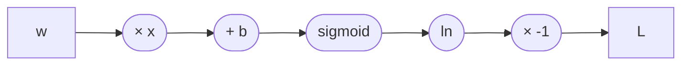

# 2.8 常见函数的导数(common derivatives)

> 重要度：⭐⭐（不必背完数学手册，但要熟练认出训练中高频出现的本地导数）
> 目标：会求 $x^2$、$e^x$、$\ln x$、sigmoid 的导数；能把幂法则、线性法则和链式法则组合起来
> 前置：2.1 导数 · 2.2 偏导数 · 2.4 链式法则 · 2.7 计算图与自动求导
> 配套脚本：[`examples/2_8_common_derivatives.py`](../../examples/2_8_common_derivatives.py)
> 配套自测：[`2.8-自测题.md`](2.8-自测题.md)

---

## 一句话总结

**常见函数的导数就是自动求导引擎保存的“本地反向规则”；复杂模型的梯度，是这些简单规则通过求和、相乘和链式法则组合出来的。**

这一节最少要记住四个：

$$
\boxed{
(x^n)'=nx^{n-1},
\qquad
(e^x)'=e^x,
\qquad
(\ln x)'=\frac{1}{x},
\qquad
\sigma'(x)=\sigma(x)(1-\sigma(x))
}
$$

把 2.7 的自动求导再翻译一遍：

```text
前向：每个节点计算自己的函数值
反向：每个节点查出自己的本地导数
      × 收到的上游梯度
      → 传给父节点
```

所以，本节不是孤立地背公式，而是在补齐计算图中常见节点的“反向说明书”。

---

## 1. 先分清：导数函数与某一点的导数

例如：

$$
f(x)=x^2
$$

对整个函数求导：

$$
f'(x)=2x
$$

这里的 $2x$ 仍然是一个**函数**，告诉我们每个位置的斜率。

在 $x=3$ 处代入：

$$
f'(3)=2\times3=6
$$

这里的 $6$ 才是某一个点上的**具体斜率数值**。

| 写法 | 含义 | 本例 |
|---|---|---|
| $f'(x)$ | 导数函数 | $2x$ |
| $\dfrac{df}{dx}$ | $f$ 对 $x$ 的导数 | $2x$ |
| $\left.\dfrac{df}{dx}\right|_{x=3}$ | 在 $x=3$ 处的导数 | $6$ |

> 常见错误：算出 $f'(x)=2x$ 后就结束，但题目问的是 $f'(3)$；或者只算出一个点的数值，却忘了先写出导数函数。

---

## 2. 核心导数表

### 2.1 基础函数

| 原函数 $f(x)$ | 导数 $f'(x)$ | 记忆方式 / 注意事项 |
|---|---|---|
| 常数 $c$ | $0$ | 水平线没有变化 |
| $x$ | $1$ | 输入增加多少，输出就增加多少 |
| $x^n$ | $nx^{n-1}$ | 指数拿到前面，原指数减 1 |
| $\dfrac{1}{x}=x^{-1}$ | $-\dfrac{1}{x^2}$ | 直接用幂法则 |
| $\sqrt{x}=x^{1/2}$ | $\dfrac{1}{2\sqrt{x}}$ | 直接用幂法则；实数范围内 $x>0$ |
| $e^x$ | $e^x$ | 导数仍是自己 |
| $a^x$ | $a^x\ln a$ | 只有底数为 $e$ 时不多出系数 |
| $\ln x$ | $\dfrac{1}{x}$ | 实数范围内要求 $x>0$ |
| $\log_a x$ | $\dfrac{1}{x\ln a}$ | 机器学习中的 `log` 通常指自然对数 |

### 2.2 深度学习常见激活函数

| 函数 | 导数 | 关键性质 |
|---|---|---|
| sigmoid：$\sigma(x)=\dfrac{1}{1+e^{-x}}$ | $\sigma(x)(1-\sigma(x))$ | 导数最大只有 $\frac14$ |
| $\tanh x$ | $1-\tanh^2x$ | 在 $x=0$ 处导数最大，为 $1$ |
| ReLU：$\max(0,x)$ | $x<0$ 时 $0$；$x>0$ 时 $1$ | $x=0$ 处不可导，框架通常约定为 $0$ |
| softplus：$\ln(1+e^x)$ | $\sigma(x)$ | ReLU 的平滑版本 |
| SiLU / swish：$x\sigma(x)$ | $\sigma(x)+x\sigma(x)(1-\sigma(x))$ | LLM 的 SwiGLU 中会遇到 |

对于 GELU、SiLU、softmax、LayerNorm 等函数：

- 要**理解输入输出和导数的大致行为**
- 要能看懂框架或论文中的公式
- 通常不要求脱离资料默写全部复杂导数

本节最需要形成肌肉记忆的仍是：**幂函数、指数、自然对数、sigmoid**。

---

## 3. 幂法则：覆盖的不只是 $x^2$

幂法则：

$$
\boxed{\frac{d}{dx}x^n=nx^{n-1}}
$$

### 3.1 正整数指数

$$
(x^2)'=2x
$$

$$
(x^5)'=5x^4
$$

### 3.2 指数为 1 或 0

$$
(x^1)'=1x^0=1
$$

$$
(x^0)'=(1)'=0
$$

第二个式子里不能机械地纠结 $0x^{-1}$；$x^0$ 本来就是常数 $1$，常数导数为 $0$。

### 3.3 负指数

$$
\frac{1}{x}=x^{-1}
$$

所以：

$$
\left(\frac{1}{x}\right)'
=
-x^{-2}
=
-\frac{1}{x^2}
$$

### 3.4 分数指数

$$
\sqrt{x}=x^{1/2}
$$

所以：

$$
(\sqrt{x})'
=
\frac12x^{-1/2}
=
\frac{1}{2\sqrt{x}}
$$

> 幂法则形式统一，但函数的**定义域**仍要单独检查。例如 $1/x$ 在 $x=0$ 没有定义，$\ln x$ 在实数范围内只对 $x>0$ 有定义。

### 3.5 和训练的联系：平方误差

单个样本的平方误差：

$$
L=(\hat y-y)^2
$$

令误差：

$$
e=\hat y-y
$$

先使用幂法则：

$$
\frac{\partial L}{\partial e}=2e
$$

再用链式法则：

$$
\frac{\partial L}{\partial\hat y}
=
\frac{\partial L}{\partial e}
\frac{\partial e}{\partial\hat y}
=
2e\times1
=
2(\hat y-y)
$$

这就是 2.7 的自动求导例子中，平方节点保存的本地规则。

---

## 4. 求导规则：负责把基础公式组合起来

只有基础导数表还不够。真实函数通常是多个函数组合而成，需要下面几条规则。

### 4.1 常数倍法则

$$
\frac{d}{dx}[cf(x)]=cf'(x)
$$

例如：

$$
f(x)=5x^2
$$

$$
f'(x)=5\cdot2x=10x
$$

### 4.2 加减法则

$$
\frac{d}{dx}[f(x)\pm g(x)]
=
f'(x)\pm g'(x)
$$

例如：

$$
f(x)=3x^4-2x+7
$$

逐项求导：

$$
f'(x)=12x^3-2
$$

其中常数 $7$ 的导数为 $0$。

### 4.3 乘积法则

$$
\boxed{(fg)'=f'g+fg'}
$$

不是：

$$
(fg)'\ne f'g'
$$

例如 SiLU：

$$
\operatorname{SiLU}(x)=x\sigma(x)
$$

因此：

$$
\begin{aligned}
\operatorname{SiLU}'(x)
&=1\cdot\sigma(x)+x\cdot\sigma'(x)\\
&=\sigma(x)+x\sigma(x)(1-\sigma(x))
\end{aligned}
$$

### 4.4 商法则

$$
\boxed{
\left(\frac{f}{g}\right)'
=
\frac{f'g-fg'}{g^2}
}
$$

可以记作：

> 下乘上导，减上乘下导，除以下平方。

不过在深度学习推导中，很多除法也可以写成负指数，再结合乘积法则和链式法则处理。

### 4.5 链式法则

若：

$$
y=f(u),\qquad u=g(x)
$$

则：

$$
\boxed{
\frac{dy}{dx}
=
\frac{dy}{du}
\frac{du}{dx}
}
$$

例如：

$$
y=e^{2x+1}
$$

令：

$$
u=2x+1
$$

则：

$$
\frac{dy}{du}=e^u,
\qquad
\frac{du}{dx}=2
$$

所以：

$$
\frac{dy}{dx}
=
e^u\cdot2
=
2e^{2x+1}
$$

> 最常见漏项：看见 $e^x$ 的导数是 $e^x$，就把 $e^{2x+1}$ 的导数也写成自己，忘了乘里面的导数 $2$。

---

## 5. 指数函数：为什么 $(e^x)'=e^x$

自然指数函数：

$$
f(x)=e^x
$$

拥有一个非常特殊的性质：

$$
\boxed{f'(x)=e^x=f(x)}
$$

也就是说，它在每个点的斜率恰好等于当前函数值。

| $x$ | $e^x$ | $(e^x)'$ |
|---:|---:|---:|
| $-2$ | $0.1353$ | $0.1353$ |
| $0$ | $1$ | $1$ |
| $1$ | $2.7183$ | $2.7183$ |

### 5.1 一般底数

若底数不是 $e$：

$$
\frac{d}{dx}a^x=a^x\ln a
$$

例如：

$$
\frac{d}{dx}2^x=2^x\ln2
$$

### 5.2 复合指数

$$
\frac{d}{dx}e^{g(x)}
=
e^{g(x)}g'(x)
$$

例如：

$$
\frac{d}{dx}e^{-x}
=
e^{-x}\cdot(-1)
=
-e^{-x}
$$

### 5.3 和 LLM 的联系

softmax 会把每个 logit $z_i$ 变成：

$$
p_i
=
\frac{e^{z_i}}{\sum_j e^{z_j}}
$$

指数函数让较大的 logit 获得更大的相对权重，再通过分母归一化成概率。

但是直接计算很大的 $e^{z_i}$ 可能溢出，所以代码通常先减去最大值：

$$
\operatorname{softmax}(z_i)
=
\frac{e^{z_i-m}}{\sum_j e^{z_j-m}},
\qquad
m=\max_j z_j
$$

所有 logit 同时减去同一个常数不会改变 softmax 的结果，却能显著提高数值稳定性。

---

## 6. 对数函数：变化越来越慢

自然对数：

$$
f(x)=\ln x
$$

导数为：

$$
\boxed{
\frac{d}{dx}\ln x=\frac1x
}
$$

| $x$ | 导数 $1/x$ | 含义 |
|---:|---:|---|
| $0.1$ | $10$ | 靠近 0 时非常陡 |
| $1$ | $1$ | 斜率为 1 |
| $10$ | $0.1$ | 输入很大后变化变慢 |

### 6.1 复合对数

$$
\frac{d}{dx}\ln g(x)
=
\frac{g'(x)}{g(x)}
$$

例如：

$$
f(x)=\ln(x^2+1)
$$

外层：

$$
\frac{d}{du}\ln u=\frac1u
$$

内层：

$$
\frac{d}{dx}(x^2+1)=2x
$$

所以：

$$
f'(x)
=
\frac{1}{x^2+1}\cdot2x
=
\frac{2x}{x^2+1}
$$

### 6.2 为什么损失函数喜欢使用 $-\ln p$？

若正确答案的预测概率为 $p$，负对数损失为：

$$
L=-\ln p
$$

它对 $p$ 的导数：

$$
\frac{dL}{dp}
=
-\frac1p
$$

比较：

| 正确答案概率 $p$ | 损失 $-\ln p$ | 导数 $-1/p$ |
|---:|---:|---:|
| $0.9$ | $0.105$ | $-1.111$ |
| $0.5$ | $0.693$ | $-2$ |
| $0.01$ | $4.605$ | $-100$ |

模型非常自信地预测错时，正确答案概率接近 $0$，损失以及**损失对概率 $p$ 的局部梯度**都会变大。

但要分清求导对象：与 softmax 组合后，损失对 logits 的梯度会简化为 $\mathbf p-\mathbf y$，不会保留 $-1/p$ 的发散形式。这里的 $-1/p$ 描述的是 `log` 节点传给概率节点的本地梯度。

> 实际代码不会先算一个极小概率再直接取 `log`，而会使用 `log_softmax`、`cross_entropy` 等数值稳定实现。

---

## 7. sigmoid：导数可以复用前向结果

sigmoid 函数：

$$
\sigma(x)=\frac{1}{1+e^{-x}}
$$

读作 **sigma**，中文常读“西格玛”。它把任意实数压缩到 $(0,1)$。

### 7.1 推导

先写成幂函数形式：

$$
\sigma(x)=(1+e^{-x})^{-1}
$$

使用链式法则：

$$
\begin{aligned}
\sigma'(x)
&=-(1+e^{-x})^{-2}\cdot(-e^{-x})\\
&=\frac{e^{-x}}{(1+e^{-x})^2}
\end{aligned}
$$

又因为：

$$
\sigma(x)=\frac1{1+e^{-x}}
$$

以及：

$$
1-\sigma(x)
=
\frac{e^{-x}}{1+e^{-x}}
$$

两者相乘：

$$
\sigma(x)(1-\sigma(x))
=
\frac{e^{-x}}{(1+e^{-x})^2}
$$

因此：

$$
\boxed{
\sigma'(x)=\sigma(x)(1-\sigma(x))
}
$$

这个形式很适合自动求导：前向时已经算出 $\sigma(x)$，反向时可以直接复用它。

### 7.2 导数最大只有 $\frac14$

当 $x=0$：

$$
\sigma(0)=\frac12
$$

所以：

$$
\sigma'(0)
=
\frac12\left(1-\frac12\right)
=
\frac14
$$

| $x$ | $\sigma(x)$ | $\sigma'(x)$ |
|---:|---:|---:|
| $-10$ | $\approx0$ | $\approx0$ |
| $0$ | $0.5$ | $0.25$ |
| $10$ | $\approx1$ | $\approx0$ |

在两端：

- $x\ll0$ 时，$\sigma(x)\approx0$
- $x\gg0$ 时，$\sigma(x)\approx1$
- 两种情况的 $\sigma(x)(1-\sigma(x))$ 都接近 $0$

这叫 **饱和(saturation)**。若很多层的本地导数都很小，链式法则把它们连续相乘，前面层收到的梯度就会趋近 $0$。

这正是 2.10“梯度消失”的入口。

### 7.3 sigmoid 在现代 LLM 中的位置

现代 Transformer 通常不会把普通 sigmoid 当作每层的主激活函数，但它仍会出现在：

- 二分类输出
- 门控结构
- LSTM / GRU 的门
- SiLU / swish 与 SwiGLU

所以要会认、会求导，也要知道它的饱和问题。

---

## 8. tanh、ReLU、softplus 与 SiLU

### 8.1 tanh

$$
\tanh'(x)=1-\tanh^2(x)
$$

tanh 输出范围为 $(-1,1)$，以 $0$ 为中心。

在 $x=0$：

$$
\tanh(0)=0,
\qquad
\tanh'(0)=1
$$

但当 $|x|$ 很大时，$\tanh(x)$ 接近 $-1$ 或 $1$，导数也接近 $0$，因此同样存在饱和问题。

### 8.2 ReLU

$$
\operatorname{ReLU}(x)=\max(0,x)
$$

分段导数：

$$
\operatorname{ReLU}'(x)
=
\begin{cases}
0,&x<0\\
1,&x>0
\end{cases}
$$

在 $x=0$ 处：

- 左导数为 $0$
- 右导数为 $1$
- 两边不相等
- 因此普通导数不存在

深度学习框架为了继续计算，会选定一个约定值，PyTorch 通常取 $0$。

> “框架返回了梯度”不等于“数学上处处可导”。在不可导点，框架采用的是约定的次梯度或反向规则。

### 8.3 softplus

$$
\operatorname{softplus}(x)=\ln(1+e^x)
$$

使用链式法则：

$$
\begin{aligned}
\operatorname{softplus}'(x)
&=\frac{1}{1+e^x}\cdot e^x\\
&=\frac{e^x}{1+e^x}\\
&=\frac{1}{1+e^{-x}}\\
&=\sigma(x)
\end{aligned}
$$

因此：

$$
\boxed{
\operatorname{softplus}'(x)=\sigma(x)
}
$$

softplus 可以看作 ReLU 的平滑版本。

### 8.4 SiLU / swish

$$
\operatorname{SiLU}(x)=x\sigma(x)
$$

使用乘积法则：

$$
\boxed{
\operatorname{SiLU}'(x)
=
\sigma(x)+x\sigma(x)(1-\sigma(x))
}
$$

SiLU 是现代神经网络常见激活函数；SwiGLU 也使用了类似的门控思想。

---

## 9. 一个完整组合：sigmoid + 对数损失

为了看清这些导数怎样真正进入训练，考虑二分类：

$$
z=wx+b
$$

$$
p=\sigma(z)
$$

其中 $p$ 是预测为类别 $1$ 的概率，标签 $y\in\{0,1\}$。

二元交叉熵：

$$
L
=
-\left[
y\ln p+(1-y)\ln(1-p)
\right]
$$

### 9.1 先求损失对概率的导数

$$
\frac{\partial L}{\partial p}
=
-\frac{y}{p}
+\frac{1-y}{1-p}
$$

### 9.2 sigmoid 的本地导数

$$
\frac{\partial p}{\partial z}
=
p(1-p)
$$

### 9.3 链式相乘

$$
\begin{aligned}
\frac{\partial L}{\partial z}
&=
\frac{\partial L}{\partial p}
\frac{\partial p}{\partial z}\\
&=
\left(
-\frac{y}{p}
+\frac{1-y}{1-p}
\right)p(1-p)\\
&=-y(1-p)+(1-y)p\\
&=p-y
\end{aligned}
$$

得到一个非常简洁的结果：

$$
\boxed{
\frac{\partial L}{\partial z}=p-y
}
$$

因为：

$$
\frac{\partial z}{\partial w}=x,
\qquad
\frac{\partial z}{\partial b}=1
$$

所以：

$$
\boxed{
\frac{\partial L}{\partial w}=(p-y)x,
\qquad
\frac{\partial L}{\partial b}=p-y
}
$$

这段推导把本节四类知识串了起来：

```text
线性函数 wx+b
      ↓
sigmoid（包含 exp）
      ↓
交叉熵（包含 log）
      ↓
链式法则
      ↓
参数梯度 dL/dw、dL/db
```

LLM 使用的是多分类 softmax + 交叉熵，而不是这个二分类 sigmoid 版本；但会得到相似的简洁结构：

$$
\frac{\partial L}{\partial\mathbf z}
=
\mathbf p-\mathbf y
$$

后续 3.2 softmax 和 3.3 交叉熵会正式展开。

---

## 10. 手算示例

### 示例 1：多项式

$$
f(x)=4x^3-5x^2+2x-8
$$

逐项求导：

$$
f'(x)=12x^2-10x+2
$$

在 $x=2$：

$$
f'(2)
=
12\cdot4-10\cdot2+2
=
30
$$

### 示例 2：指数复合函数

$$
f(x)=e^{-3x}
$$

外层导数仍是指数函数，内层 $-3x$ 的导数为 $-3$：

$$
f'(x)=-3e^{-3x}
$$

### 示例 3：对数复合函数

$$
f(x)=\ln(2x+1)
$$

$$
f'(x)
=
\frac{1}{2x+1}\cdot2
=
\frac{2}{2x+1}
$$

### 示例 4：平方损失

$$
L(w)=(3w-2)^2
$$

外层平方的导数：

$$
2(3w-2)
$$

内层导数：

$$
3
$$

所以：

$$
\frac{dL}{dw}
=
2(3w-2)\cdot3
=
6(3w-2)
$$

### 示例 5：sigmoid 复合函数

$$
f(x)=\sigma(2x+1)
$$

$$
f'(x)
=
\sigma(2x+1)
\left[1-\sigma(2x+1)\right]
\cdot2
$$

不要漏掉最后来自内层的 $2$。

---

## 11. 定义域、不可导点与数值稳定

### 11.1 公式成立前，先确认函数有定义

| 函数 | 实数定义域中的注意点 |
|---|---|
| $1/x$ | $x\ne0$ |
| $\sqrt{x}$ | $x\ge0$；导数公式在 $x=0$ 发散 |
| $\ln x$ | $x>0$ |
| ReLU | $x=0$ 处不可导 |

不能在原函数都没有定义的点，机械地代入导数公式。

### 11.2 数值差分在不可导点可能给出“误导性答案”

中心差分：

$$
f'(x)\approx
\frac{f(x+h)-f(x-h)}{2h}
$$

对 ReLU 在 $x=0$：

$$
\frac{\operatorname{ReLU}(h)-\operatorname{ReLU}(-h)}{2h}
=
\frac{h-0}{2h}
=
\frac12
$$

但这不代表 ReLU 在 $0$ 处导数是 $\frac12$。真正的问题是：

$$
\text{左导数}=0
\ne
1=\text{右导数}
$$

所以导数不存在；$\frac12$ 只是中心差分横跨折点得到的平均效果。

### 11.3 数值稳定不是改变数学公式

例如：

$$
\sigma(x)=\frac1{1+e^{-x}}
$$

当 $x$ 是很大的负数时，直接计算 $e^{-x}$ 可能溢出。代码可以按 $x$ 的正负使用等价写法：

$$
\sigma(x)
=
\frac{e^x}{1+e^x}
\qquad(x<0)
$$

数学结果不变，但计算更稳定。

类似地，训练中应优先使用框架提供的：

- `cross_entropy`
- `log_softmax`
- `binary_cross_entropy_with_logits`

而不是手工先算概率、再取对数。

---

## 12. 和计算图、自动求导的对应

假设：

$$
L=-\ln(\sigma(wx+b))
$$

计算图可以拆成：



每个节点只需要知道自己的本地规则：

| 节点 | 本地导数 |
|---|---|
| 乘法 $wx$ 对 $w$ | $x$ |
| 加法 $u+b$ 对 $u$ | $1$ |
| sigmoid | $\sigma(u)(1-\sigma(u))$ |
| $\ln u$ | $1/u$ |
| 乘以 $-1$ | $-1$ |

反向传播做的事没有变化：

$$
\text{传给父节点的梯度}
=
\text{上游梯度}
\times
\text{本地导数}
$$

因此，**背常见导数的真正目的，是能看懂每个节点在反向传播时乘了什么。**

---

## 13. 记忆方法

### 必须熟记

$$
(x^n)'=nx^{n-1}
$$

> 指数搬到前面，指数减一。

$$
(e^x)'=e^x
$$

> 自然指数，导数还是自己。

$$
(\ln x)'=\frac1x
$$

> 对数求导，变成倒数。

$$
\sigma'(x)=\sigma(x)(1-\sigma(x))
$$

> sigmoid 前向结果乘“一减自己”。

### 必须避免

1. $(f+g)'$ 可以逐项求导，但 $(fg)'$ **不能**直接写成 $f'g'$。
2. 复合函数不能漏掉内层导数。
3. $\log$ 在机器学习中通常是 $\ln$，但应结合上下文确认。
4. ReLU 在 $0$ 处是不可导，不是天然等于 $0$。
5. sigmoid 导数最大只有 $0.25$，在两端饱和区接近 $0$。
6. 先检查定义域，再代入导数公式。

---

## 14. 动手验证

运行：

```bash
.venv/bin/python examples/2_8_common_derivatives.py
```

脚本会验证：

1. 常见解析导数与中心差分一致
2. 幂法则可覆盖负指数和分数指数
3. $\ln$ 与 $\exp$ 互为反函数，复合后的导数为 $1$
4. sigmoid 在 $0$ 处导数最大，在两端饱和
5. ReLU 在 $0$ 处不可导，中心差分得到的 $0.5$ 不是普通导数
6. sigmoid + 交叉熵怎样得到参数梯度
7. 很小的本地导数连续相乘后怎样迅速衰减

重点观察第 6 段：

$$
\frac{\partial L}{\partial z}=p-y
$$

以及第 7 段中不同深度的梯度乘积。

---

## ✅ 自检

1. 写出 $x^n$、$e^x$、$\ln x$、$\sigma(x)$ 的导数。
2. $f(x)=3x^4-2x+7$，求 $f'(x)$。
3. 为什么 $(e^{2x+1})'$ 不是只有 $e^{2x+1}$？
4. 求 $\ln(x^2+1)$ 的导数。
5. 推导 $\sigma'(x)=\sigma(x)(1-\sigma(x))$。
6. sigmoid 在哪里导数最大？最大值是多少？两端为什么会产生小梯度？
7. ReLU 在 $0$ 处为什么不可导？框架怎样继续反向传播？
8. 若 $L=-\ln p$，求 $dL/dp$；当 $p$ 很小时，梯度有什么特点？
9. 自动求导为什么仍然需要“常见函数的导数”？
10. 完成 [`2.8-自测题.md`](2.8-自测题.md) 的手算和应用题。

---

## 🔗 延伸

- 2.1 导数（变化率与切线斜率）
- 2.4 链式法则（把本地导数组合成整体导数）
- 2.7 计算图与自动求导（框架怎样保存并执行本地规则）
- 2.9 局部最小 / 鞍点（导数为 $0$ 后还可能是什么）
- 2.10 梯度消失 / 爆炸（本地导数连续相乘后的结果）
- 3.2 softmax（指数函数如何把 logits 变成概率）
- 3.3 交叉熵（对数怎样构成语言模型损失）
